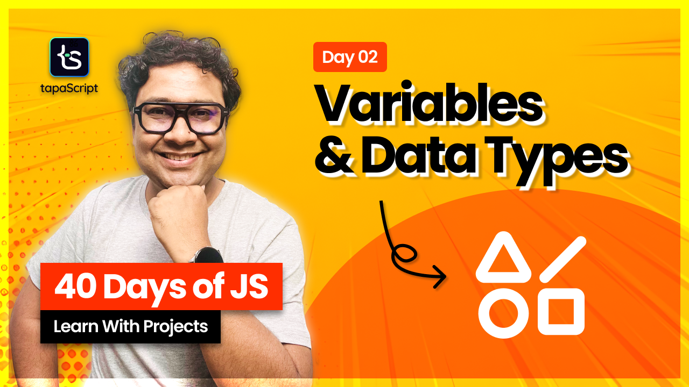

# Day 02 - 40 Days of JavaScript

## **🎯 Goal of This Lesson**

- What is Variable?
- How to visualize variables?
- How Variables get stored?
- JavaScript Data Types
- How JavaScript sees code?

## 🫶 Support
Your support means a lot.

- Please SUBSCRIBE to [tapaScript YouTube Channel](https://youtube.com/tapasadhikary) if not done already. A Big Thank You!
- Liked my work? It takes months of hard work to create quality content and present it to you. You can show your support to me with a STAR(⭐) to this repository.

    > Many Thanks to all the `Stargazers` who have supported this project with stars(⭐)

### 🤝 Sponsor My Work
I am an independent educator and open-source enthusiast who creates meaningful projects to teach programming on my YouTube Channel. **You can support my work by [Sponsoring me on GitHub](https://github.com/sponsors/atapas) or [Buy Me a Coffee](https://buymeacoffee.com/tapasadhikary)**.

## Video
Here is the video for you to go through and learn:

## **👩‍💻 🧑‍💻 Assignment Tasks**

- ✅ Task 1: Declare variables for a person’s name, age, isStudent status, and favorite programming language.
- ✅ Task 2: Print the values to the console.
- ✅ Task 3: Try reassigning values to let and const variables and observe errors.
- ✅ Task 4: Create an object and an array, assign them to new variables, modify, and observe changes.
