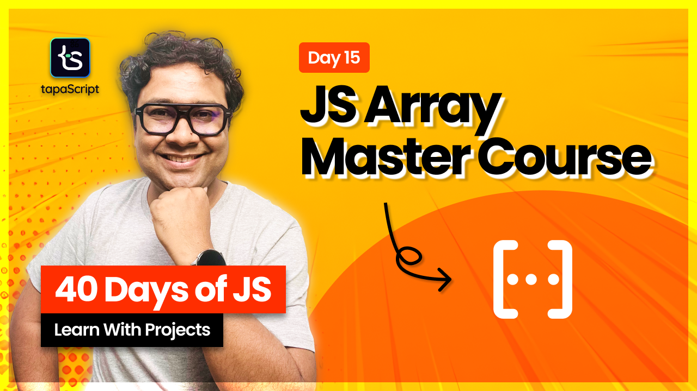

# Day 15 - 40 Days of JavaScript - JavaScript Array Master Course

## **🎯 Goal of This Lesson**

## 📚 Course Flow

- [ ] Introduction
- [ ] What is an Array in JavaScript?
- [ ] How to Create an Array in JavaScript?
- [ ] How to Get Elements from an Array in JS?
- [ ] How to Add Elements to an Array in JS?
- [ ] How to Remove Elements from an Array in JS?
- [ ] How to Copy and Clone an Array in JS?
- [ ] How to Determine if a Value is an Array in JS?
- [ ] Array Destructuring in JavaScript
- [ ] How to Assign a Default Value to a Variable?
- [ ] How to Skip a Value in an Array?
- [ ] Nested Array Destructuring in JS
- [ ] How to Use the Rest Parameter in JS?
- [ ] How to Use the Spread Operator in JS?
- [ ] Destructuring Use Cases in JavaScript
  - [ ] How to Swap Values with Destructuring?
  - [ ] How to Merge Arrays?
- [ ] The length property
- [ ] JavaScript Array Methods
  - [ ] How to Create, Remove, Update, and Access Arrays in JavaScript?
    - [ ] The concat() array method
    - [ ] The join() array method
    - [ ] The fill() array method
    - [ ] The includes() array method
    - [ ] The indexOf() array method
    - [ ] The reverse() array method
    - [ ] The sort() array method
    - [ ] The splice() array method
    - [ ] The at() Method
    - [ ] The copyWithin() Method
    - [ ] The flat() Method
  - [ ] Static Array Methods in JavaScript
    - [ ] The Array-Like
    - [ ] The Array.from() array method
    - [ ] The Array.fromAsync() array method
    - [ ] The Array.of() array method
  - [ ] Array Iterator Methods in JavaScript
    - [ ] The filter() array method
    - [ ] The map() array method
    - [ ] The flatMap() array method
    - [ ] The reduce() array method
    - [ ] The reduceRight() array method
    - [ ] The some() array method
    - [ ] The find() array method
    - [ ] The findIndex() array method
      - [ ] The findLast() array method
      - [ ] The findLastIndex() array method
      - [ ] The forEach() array method
      - [ ] The every() array method
      - [ ] The entries() method
      - [ ] The values() method
  - [ ] Immutability
    - [ ] The toReversed() method
    - [ ] The toSorted() method
    - [ ] The toSpliced() method
    - [ ] The with() method
- [ ] Tasks and Quizzes With Interview Questions

## 🫶 Support

Your support means a lot.

- Please SUBSCRIBE to [tapaScript YouTube Channel](https://youtube.com/tapasadhikary) if not done already. A Big Thank You!
- Liked my work? It takes months of hard work to create quality content and present it to you. You can show your support to me with a STAR(⭐) to this repository.

    > Many Thanks to all the `Stargazers` who have supported this project with stars(⭐)

### 🤝 Sponsor My Work

I am an independent educator and open-source enthusiast who creates meaningful projects to teach programming on my YouTube Channel. **You can support my work by [Sponsoring me on GitHub](https://github.com/sponsors/atapas) or [Buy Me a Cofee](https://buymeacoffee.com/tapasadhikary)**.

## Video

Here is the video for you to go through and learn:

## **👩‍💻 🧑‍💻 Assignment Tasks**

Please find the task assignments in the [Task File](./task.md).
