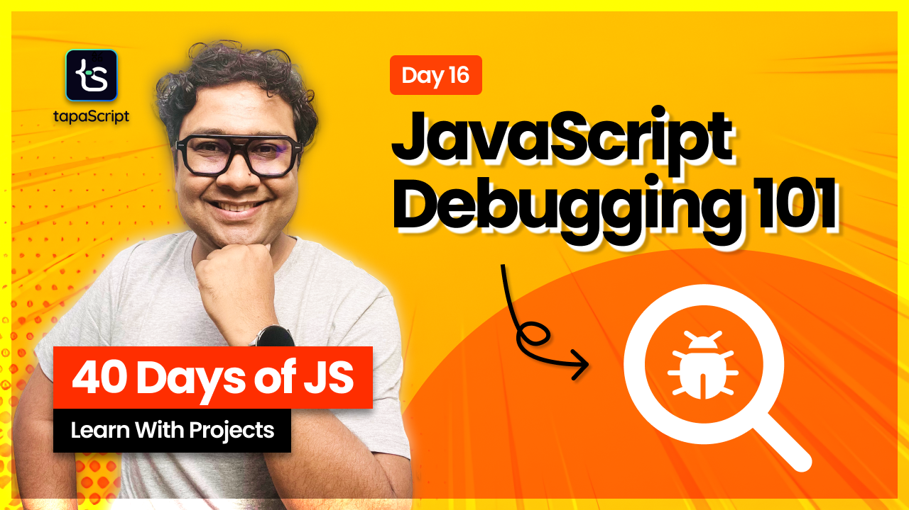

# Day 16 - 40 Days of JavaScript - JavaScript Debugging

## **🎯 Goal of This Lesson**

- ✅ Introduction
- ✅ What is Debugging?
- ✅ Application to Debug
- ✅ The famous console.log
- ✅ DevTools Overview
- ✅ The Source Panel
- ✅ Setting Debug Points
- ✅ Debugging Code
- ✅ Conditional Breakpoint
- ✅ Debug Handlers
- ✅ Debug DOM Changes
- ✅ The "debugger" Handle
- ✅ Debugging Scope
- ✅ Observing Call Stack
- ✅ Watching Variable Expressions
- ✅ Edit and Save on Run Time
- ✅ Workspace
- ✅ Debugging with VS Code
- ✅ A Few Debugging Tips

## 🫶 Support

Your support means a lot.

- Please SUBSCRIBE to [tapaScript YouTube Channel](https://youtube.com/tapasadhikary) if not done already. A Big Thank You!
- Liked my work? It takes months of hard work to create quality content and present it to you. You can show your support to me with a STAR(⭐) to this repository.

    > Many Thanks to all the `Stargazers` who have supported this project with stars(⭐)

### 🤝 Sponsor My Work

I am an independent educator and open-source enthusiast who creates meaningful projects to teach programming on my YouTube Channel. **You can support my work by [Sponsoring me on GitHub](https://github.com/sponsors/atapas) or [Buy Me a Coffee](https://buymeacoffee.com/tapasadhikary)**.

## Video

Here is the video for you to go through and learn:

