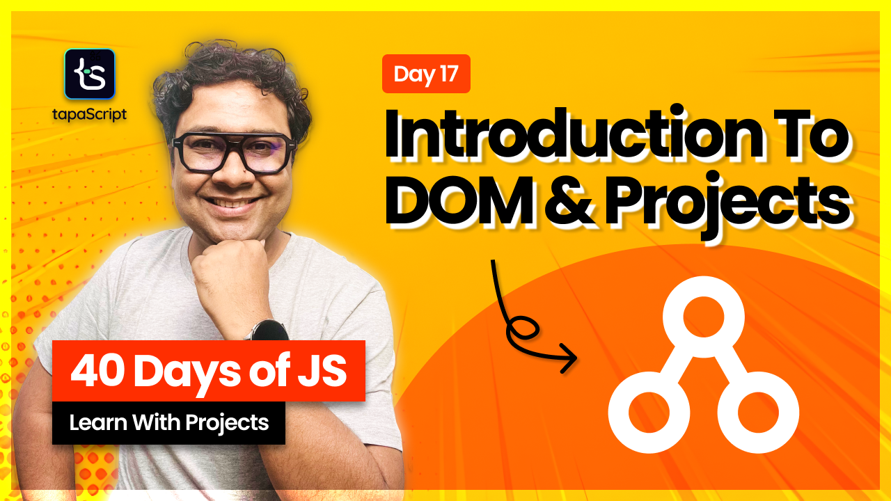

# Day 17 - 40 Days of JavaScript - Intro to JavaScript DOM

## **🎯 Goal of This Lesson**

- ✅ Module 3 & DOM
- ✅ Expense Tracker Project
- ✅ What is DOM?
- ✅ DOM and JavaScript
- ✅ What else to Cover?
- ✅ DOM Types
- ✅ Accessing DOM
- ✅ Get Element By ID
- ✅ Get Element By Class Name
- ✅ Get Element By Tag Name
- ✅ Query Selector
- ✅ Query Selector All
- ✅ Mini Project 1
- ✅ Mini Project 2
- ✅ About Task
- ✅ Playing With DOM on DevTools

## 🫶 Support

Your support means a lot.

- Please SUBSCRIBE to [tapaScript YouTube Channel](https://youtube.com/tapasadhikary) if not done already. A Big Thank You!
- Liked my work? It takes months of hard work to create quality content and present it to you. You can show your support to me with a STAR(⭐) to this repository.

    > Many Thanks to all the `Stargazers` who have supported this project with stars(⭐)

### 🤝 Sponsor My Work

I am an independent educator and open-source enthusiast who creates meaningful projects to teach programming on my YouTube Channel. **You can support my work by [Sponsoring me on GitHub](https://github.com/sponsors/atapas) or [Buy Me a Coffee](https://buymeacoffee.com/tapasadhikary)**.

## Video

Here is the video for you to go through and learn:

## **👩‍💻 🧑‍💻 Assignment Tasks**

Please find the task assignments in the [Task File](./task.md).
