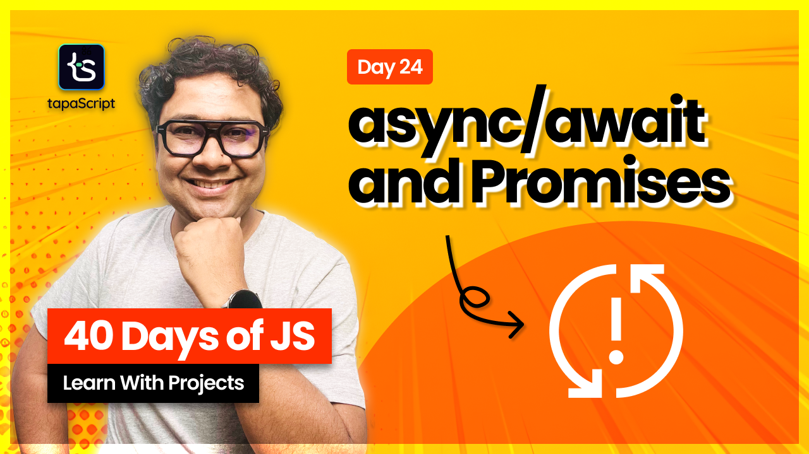

# Day 24 - 40 Days of JavaScript - Async JavaScript - async/await

## **🎯 Goal of This Lesson**

- ✅  Introduction
- ✅  What Will We Learn?
- ✅  Why async/await?
- ✅  The async Keyword
- ✅  The await Keyword
- ✅  Is await synchronous?
- ✅  Error Handling
- ✅  Project - Weather App
- ✅  Top Level await
- ✅  Handling Multiple async/await
- ✅  The pizzahub with async/await
- ✅  Tasks & Project

## How to run the API?

- Open the terminal and change the directory to `api/pizzahub`.
- Then install the dependencies with `npm install` command.
- Run the API server locally with `npm run start` command.

The API server will be available on `localhost:3000`.

## 🫶 Support

Your support means a lot.

- Please SUBSCRIBE to [tapaScript YouTube Channel](https://youtube.com/tapasadhikary) if not done already. A Big Thank You!
- Liked my work? It takes months of hard work to create quality content and present it to you. You can show your support to me with a STAR(⭐) to this repository.

    > Many Thanks to all the `Stargazers` who have supported this project with stars(⭐)

### 🤝 Sponsor My Work

I am an independent educator and open-source enthusiast who creates meaningful projects to teach programming on my YouTube Channel. **You can support my work by [Sponsoring me on GitHub](https://github.com/sponsors/atapas) or [Buy Me a Coffee](https://buymeacoffee.com/tapasadhikary)**.

## Video

Here is the video for you to go through and learn:

## **👩‍💻 🧑‍💻 Assignment Tasks**

Please find the task assignments in the [Task File](./task.md).
