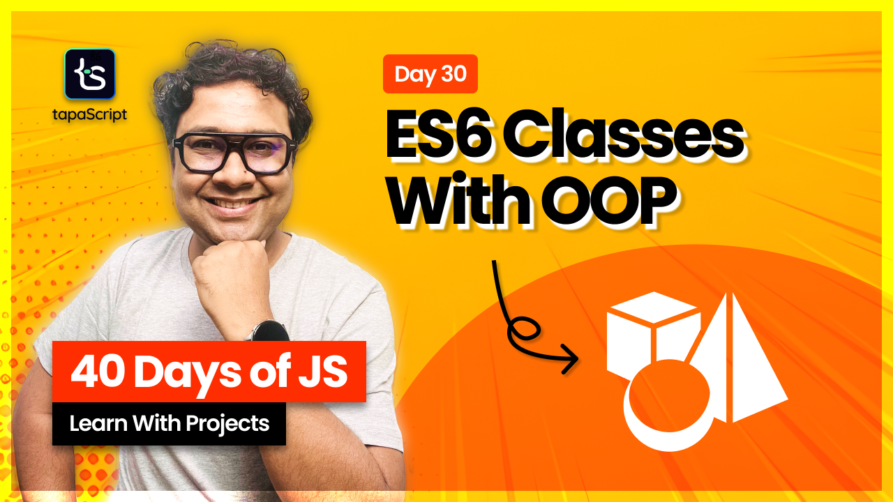

# Day 30 - 40 Days of JavaScript - Classes and OOP

## **🎯 Goal of This Lesson**

- ✅ Intro
- ✅ What Will We Learn?
- ✅ What is a Class?
- ✅ ES6 Classes - Syntax
- ✅ Initialize Objects 09:40 - “this” in Classes
- ✅ The Type of Class
- ✅ Class as Expression 19:08 - Class Fields
- ✅ Getters and Setters
- ✅ Static Properties
- ✅ Private and Public Fields
- ✅ Extending Class
- ✅ Abstraction
- ✅ Encapsulation
- ✅ Inheritance
- ✅ Polymorphism
- ✅ Composition
- ✅ What’s Next?

## 🫶 Support

Your support means a lot.

- Please SUBSCRIBE to [tapaScript YouTube Channel](https://youtube.com/tapasadhikary) if not done already. A Big Thank You!
- Liked my work? It takes months of hard work to create quality content and present it to you. You can show your support to me with a STAR(⭐) to this repository.

    > Many Thanks to all the `Stargazers` who have supported this project with stars(⭐)

### 🤝 Sponsor My Work

I am an independent educator and open-source enthusiast who creates meaningful projects to teach programming on my YouTube Channel. **You can support my work by [Sponsoring me on GitHub](https://github.com/sponsors/atapas) or [Buy Me a Coffee](https://buymeacoffee.com/tapasadhikary)**.

## Video

Here is the video for you to go through and learn:

## **👩‍💻 🧑‍💻 Assignment Tasks**

Please find the task assignments in the [Task File](./task.md).
