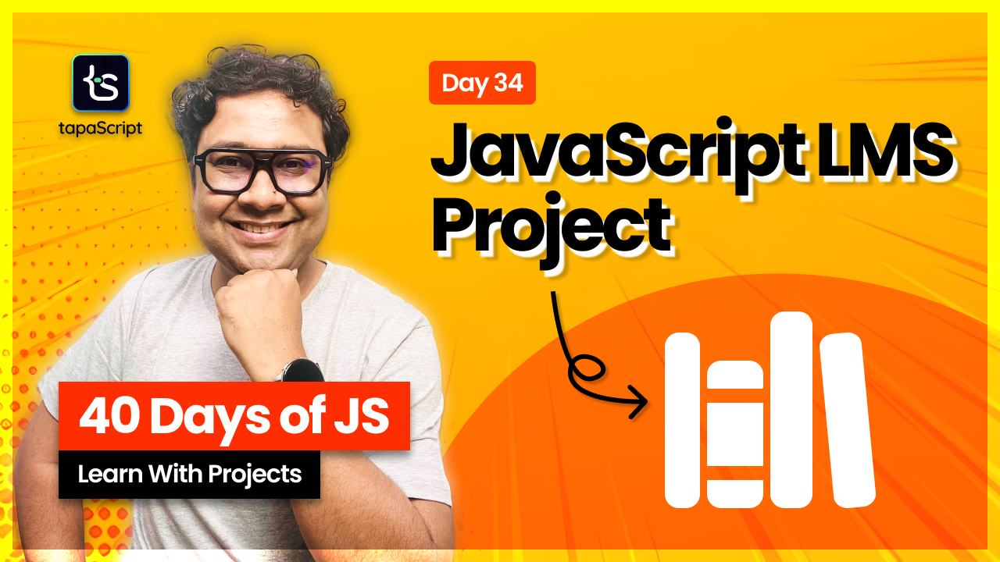

# Day 34 - 40 Days of JavaScript - Library Management System(LMS)

## **🎯 Goal of This Lesson**

- ✅ What are We Building?
- ✅ Library Management System
- ✅ Applying OOP
- ✅ Project Setup
- ✅ HTML: The View Switcher
- ✅ HTML: Add Book Form
- ✅ HTML: Available Books
- ✅ HTML: Borrowed Books
- ✅ JS: Modules & Classes
- ✅ JS: Role-Based Views
- ✅ JS: Add Books
- ✅ JS: Services
- ✅ JS: Render All Books
- ✅ JS: Event Bubbling
- ✅ JS: Borrow Tracking
- ✅ JS: Render Borrowed Books
- ✅ Task Assignments

## 🫶 Support

Your support means a lot.

- Please SUBSCRIBE to [tapaScript YouTube Channel](https://youtube.com/tapasadhikary) if not done already. A Big Thank You!
- Liked my work? It takes months of hard work to create quality content and present it to you. You can show your support to me with a STAR(⭐) to this repository.

    > Many Thanks to all the `Stargazers` who have supported this project with stars(⭐)

### 🤝 Sponsor My Work

I am an independent educator and open-source enthusiast who creates meaningful projects to teach programming on my YouTube Channel. **You can support my work by [Sponsoring me on GitHub](https://github.com/sponsors/atapas) or [Buy Me a Coffee](https://buymeacoffee.com/tapasadhikary)**.

## Video

Here is the video for you to go through and learn:

## **👩‍💻 🧑‍💻 Assignment Tasks**

Please find the task assignments in the [Task File](./task.md).
