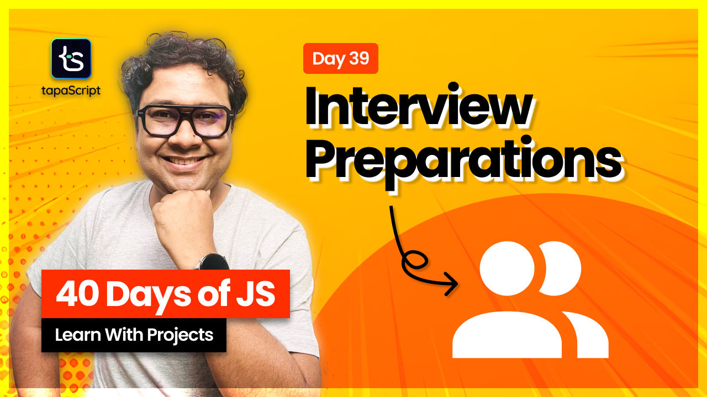

# Day 39 - JavaScript Interview Prep Guide

## **🎯 Goal of This Lesson**

- ✅ Why this Video is Essential?
- ✅ The Plan
- ✅ Top Interview Suggestions
- ✅ Freshers
- ✅ Mid-Levels
- ✅ Senior Developers
- ✅ Tech Leads/Architects
- ✅ Problem Types
- ✅ Common Mistakes
- ✅ How to Think Logically?
- ✅ Machine Coding Round
- ✅ Dos and Don’ts in Machine Coding Round
- ✅ Machine Coding Challenge
- ✅ The Hidden Power
- ✅ Confidence & Communication
- ✅ Recap & What’s next

## 🫶 Support

Your support means a lot.

- Please SUBSCRIBE to [tapaScript YouTube Channel](https://youtube.com/tapasadhikary) if not done already. A Big Thank You!
- Liked my work? It takes months of hard work to create quality content and present it to you. You can show your support to me with a STAR(⭐) to this repository.

    > Many Thanks to all the `Stargazers` who have supported this project with stars(⭐)

### 🤝 Sponsor My Work

I am an independent educator and open-source enthusiast who creates meaningful projects to teach programming on my YouTube Channel. **You can support my work by [Sponsoring me on GitHub](https://github.com/sponsors/atapas) or [Buy Me a Cofee](https://buymeacoffee.com/tapasadhikary)**.

## Video

Here is the video for you to go through and learn:

