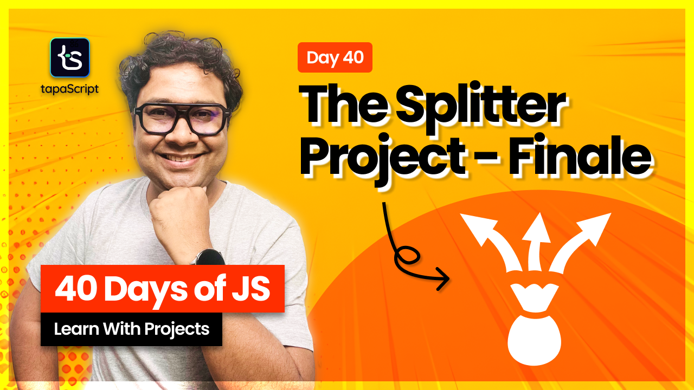

# Day 40 - A Complete JavaScript Project

## **🎯 Goal of This Lesson**

- ✅ What Can You Expect?
- ✅ Thank YOU!
- ✅ Setting the Ground
- ✅ The Requirements
- ✅ Design Breakdown
- ✅ Project Setup
- ✅ Header
- ✅ Add User UI
- ✅ Add Expense UI
- ✅ Expense & Settlement UI
- ✅ Footer
- ✅ Thinking in JavaScript
- ✅ User Model
- ✅ Expense Model
- ✅ User Service
- ✅ Expense Service
- ✅ The Expense UI
- ✅ Initialize UI Element
- ✅ DOM Helpers
- ✅ Bind Events: Add User
- ✅ Testing the Flow
- ✅ Populate Paid By
- ✅ Add a Toaster
- ✅ Add Expense Logic
- ✅ Rendering Expenses
- ✅ Expense Settling Algo
- ✅ Show Settlements
- ✅ Task Assignments
- ✅ Good Bye

## 🫶 Support

Your support means a lot.

- Please SUBSCRIBE to [tapaScript YouTube Channel](https://youtube.com/tapasadhikary) if not done already. A Big Thank You!
- Liked my work? It takes months of hard work to create quality content and present it to you. You can show your support to me with a STAR(⭐) to this repository.

    > Many Thanks to all the `Stargazers` who have supported this project with stars(⭐)

### 🤝 Sponsor My Work

I am an independent educator and open-source enthusiast who creates meaningful projects to teach programming on my YouTube Channel. **You can support my work by [Sponsoring me on GitHub](https://github.com/sponsors/atapas) or [Buy Me a Cofee](https://buymeacoffee.com/tapasadhikary)**.

## Video

Here is the video for you to go through and learn:

## **👩‍💻 🧑‍💻 Assignment Tasks**

Please find the task assignments in the [Task File](./task.md).
